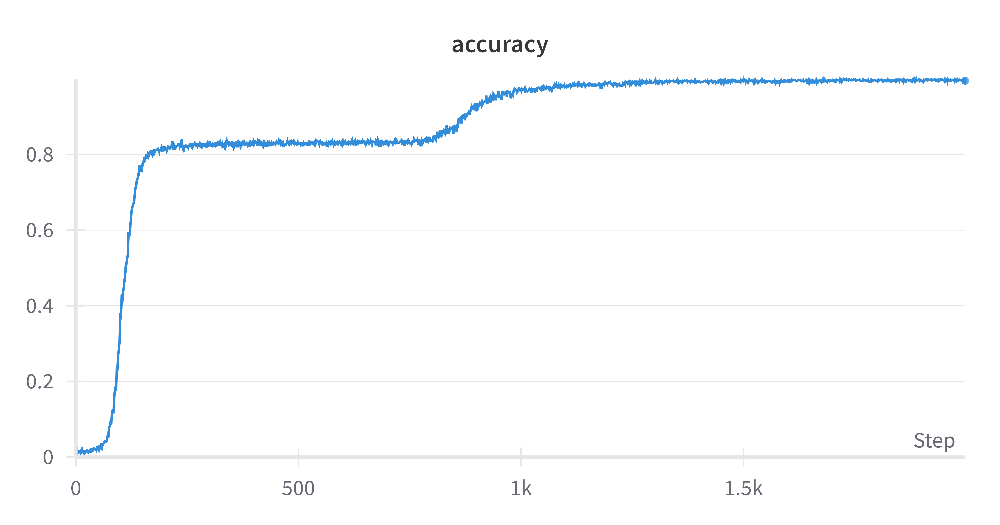
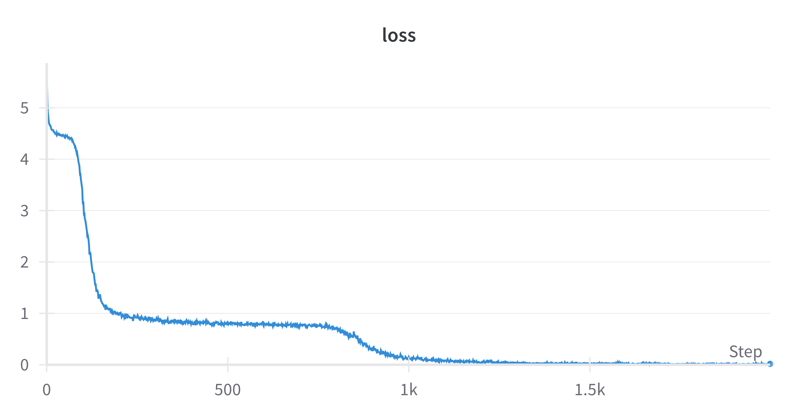

## Landmark Attention

Reproduction of "[Landmark Attention: Random-Access Infinite Context Length for Transformers](https://arxiv.org/abs/2305.16300)"

### What's the benefit?

The main benefit of landmark attention is better extrapolation, typically tested by sparse key retrieval generalizing. For example, with a long python file:

```python
# ... many lines of code ...
assert key == "afj091upgjas"
# ... many lines of code ...
```

The long-context model would output `afj091upgjas`, despite being trained on far smaller files. Landmark attention is designed to make extrapolation like this more likely.

Note: **landmark attention is still quadratic**, the goal is an architecture that generalizes from training on a short context to doing inference on a long context.

### How does it work?

The best way to understand is to stare at the following iterative implementation:

```python
attn_weights = torch.zeros_like(attn_scores)
is_landmark = lambda i: i % window_len == window_len-1
is_normal = lambda i: not is_landmark(i)
in_same_group = lambda i, j: i // window_len == j // window_len
landmark_idx = lambda i: i // window_len * window_len + window_len-1
normal_group = lambda i: slice(landmark_idx(i)-window_len+1, landmark_idx(i))

for i in range(attn_weights.shape[0]):
    if is_landmark(i):
        # softmax tokens in same landmark group
        same_group = slice(i-window_len+1, i+1)
        attn_weights[i, same_group] = attn_scores[i, same_group].softmax(-1)
    elif is_normal(i):
        other_landmark_idx = [[j] for j in range(attn_weights.shape[1]) if is_landmark(j) and not in_same_group(i, j)]
        same_group = attn_scores[i, normal_group(i)].view(-1)
        other_landmarks = attn_scores[i, other_landmark_idx].view(-1)

        # softmax same_group & other_landmarks together. the attention to the other landmarks
        # is later used to gate our attention to other normal tokens.
        denom = same_group.exp().sum() + other_landmarks.exp().sum()
        same_group_weights = same_group.exp() / denom
        other_landmark_weights = other_landmarks.exp() / denom

        # gate our attention to normal tokens in other groups by our attention to their landmarks.
        for group_weight, (l,) in zip(other_landmark_weights, other_landmark_idx):
            attn_weights[i, normal_group(l)] = group_weight * torch.softmax(attn_scores[i, normal_group(l)], -1)

        # our attention to our own group's normal tokens is not gated
        attn_weights[i, normal_group(i)] = same_group_weights

        # the full attention weights, how we pay attention to our group tokens + other group tokens, should sum to 1
        assert attn_weights[i].sum().allclose(torch.tensor(1, dtype=attn_weights.dtype``)), f'attn_weights[i].sum()={attn_weights[i].sum()}'
```

Let's work through the example used to test the implementation in `landmark.py`. For the following attention matrix:

```python
attn_scores = torch.log(torch.tensor([
    [1.,2, 3, 1, 2, 3],
    [1.,2, 3, 1, 2, 3],
    [1.,2, 3, 1, 2, 3],
    [1.,2, 3, 1, 2, 3],
    [1.,2, 3, 1, 2, 3],
    [1.,2, 3, 1, 2, 3],
], requires_grad=True, dtype=torch.float64))
```

- The 1st line is a normal token, so we have (n+1) softmax groups to compute:
  - (1) Same own normal group + other landmarks, this will be used for gating. `[1,2,-inf,-inf,-inf,3] -> [1/6, 2/6, 0, 0, 0, 3/6]`
  - (2) One for every other landmark group. In this case only 1, `[1, 2] -> [1/3, 2/3]`
  - (3) Gate by attention to other landmark tokens to get `[1/6, 2/6, 0, 1/3, 2/3] * [1, 1, 0, 3/6, 3/6] -> [1/6, 2/6, 0, 1/6, 2/6]`
- The 2nd line shows another normal token with the same reasoning applying.
- The 3rd line shows a landmark token attending to its own group.
- Etc...

Here are the full results

```python
want = torch.tensor([
    [1/6, 2/6, 0, 1/6, 2/6, 0],
    [1/6, 2/6, 0, 1/6, 2/6, 0],
    [1/6, 2/6, 3/6, 0, 0, 0],
    [1/6, 2/6, 0, 1/6, 2/6, 0],
    [1/6, 2/6, 0, 1/6, 2/6, 0],
    [0, 0, 0, 1/6, 2/6, 3/6],
], dtype=torch.float64)
```

### What I did

Instead of the long-context sparse retrieval task I experimented with a dense key-value matching task that looks like this:

```
=== definitions
a --> z
b --> p
p -> w
...
=== evaluation
b --> ?
p --> ?
```

(Randomized definitions followed by evaluation in a different order)

I was able to get good performance despite small landmark groups (one group per 4 definitions), validating information movement between groups.




Haven't gotten extrapolation working yet. With my naive implementation of the key-value task you run out of keys, and generalizing to tokens that haven't been seen before in training doesn't work well.

TODO: Fix training loop and test extrapolation.
